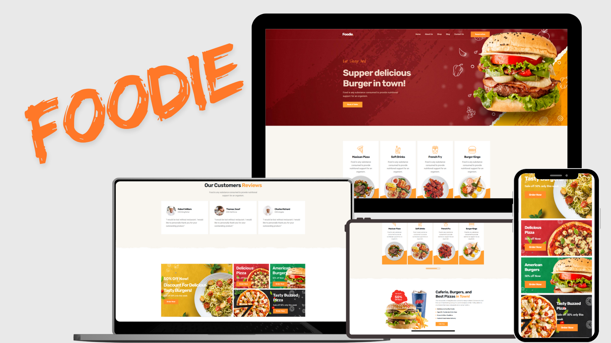

# 🍔 Foodie – Modern Restaurant & Food Delivery Website

**Foodie** is a modern, vibrant, and fully responsive restaurant website that brings your favorite dishes to life.  
From juicy burgers to cheesy pizzas, Foodie is designed to provide a mouthwatering online experience for food lovers and restaurant owners alike.



---

## ✨ Features

- **Homepage:** Eye-catching hero section with a delicious food banner and call-to-action buttons.  
- **Menu Section:** Display popular items like burgers, pizzas, fries, and drinks with images and short descriptions.  
- **Promotional Offers:** Highlight discounts and limited-time deals with bold visuals.  
- **Customer Reviews:** Showcase testimonials from satisfied customers.  
- **Reservation Page:** Allow users to book a table quickly and easily.  
- **Shop Section:** Online ordering interface for featured meals.  
- **About Page:** Share your brand’s story, mission, and kitchen philosophy.  
- **Contact Page:** Includes a form for inquiries and restaurant contact details.  
- **Fully Responsive:** Optimized for desktop, tablet, and mobile screens.  
- **Smooth Animations:** Subtle hover effects, transitions, and scrolling animations.  
- **Modern UI/UX:** Bright orange accents, clean typography, and a minimalist food-focused design.  

---

## 🛠️ Tech Stack

- **HTML5** – Structure and content layout.  
- **CSS3 / Flexbox / Grid** – Styling and responsive layouts.  
- **JavaScript (ES6)** – Dynamic UI elements and interactivity.  
- **Bootstrap (Optional)** – Streamlined responsiveness and reusable components.  

---

## ⚙️ Setup Instructions

### Clone the repository
```bash
git clone https://github.com/your-username/foodie.git
